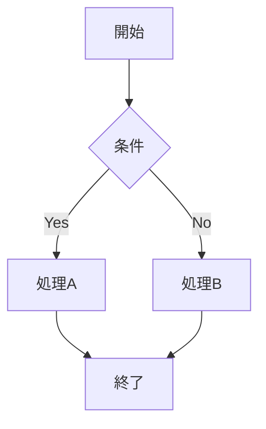
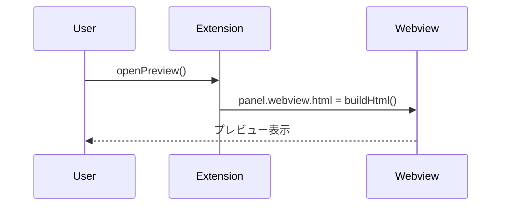
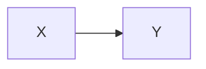

# テスト手順書 - Mermaid対応

## 概要

Mermaid対応（Phase 3）のテスト手順を記載します。
手動テストは F5 で起動した Extension Development Host 上での操作確認が基本です。

## 前提条件

- VSCodeで本リポジトリを開いている
- `npm run compile` または `npm run watch` でビルドが完了している
- `dist/mermaid.min.js` が存在する（CopyWebpackPlugin で生成）
- F5 を押して Extension Development Host が起動できる状態

---

## 手動テスト

### ケース 1: flowchart が正しく描画される

**テスト用Markdownファイルの内容:**

````markdown
# Mermaid テスト

## フローチャート


````

**手順:**

1. F5 を押して Extension Development Host を起動する
2. 上記内容の `.md` ファイルを作成・開く
3. プレビューを起動する

**期待結果:**

- flowchart のSVG図が描画される
- 「開始」「条件」「処理A」「処理B」「終了」のボックスと矢印が表示される

**確認結果:**

- [x] OK / NG

---

### ケース 2: sequenceDiagram が正しく描画される

**テスト用Markdownファイルの内容:**

````markdown
## シーケンス図


````

**手順:**

1. F5 を押して Extension Development Host を起動する
2. 上記内容の `.md` ファイルを作成・開く
3. プレビューを起動する

**期待結果:**

- sequenceDiagram のSVG図が描画される
- User・Extension・Webview の3者間のメッセージが矢印で表示される

**確認結果:**

- [x] OK / NG

---

### ケース 3: 構文エラーのある図が他に影響しない

**テスト用Markdownファイルの内容:**

````markdown
## 正常な図


## エラーのある図

```mermaid
THIS IS NOT VALID MERMAID SYNTAX !!!
```

## もう一つの正常な図



通常のMarkdownテキストも表示される。
````

**手順:**

1. F5 を押して Extension Development Host を起動する
2. 上記内容の `.md` ファイルを作成・開く
3. プレビューを起動する

**期待結果:**

- 1つ目の正常な図（`A --> B`）が描画される
- エラーのある図のブロックにエラーメッセージが表示される（または空白）
- 3つ目の正常な図（`X --> Y`）が描画される
- 通常テキストが正常に表示される
- プレビューパネルがクラッシュ・閉じることなく維持される

**確認結果:**

- [x] OK / NG

---

### ケース 4: 通常のコードブロックが影響を受けない

**テスト用Markdownファイルの内容:**

````markdown
## TypeScriptコード

```typescript
const x: number = 1;
console.log(x);
```

## Mermaid図


````

**手順:**

1. F5 を押して Extension Development Host を起動する
2. 上記内容の `.md` ファイルを作成・開く
3. プレビューを起動する

**期待結果:**

- TypeScriptコードブロックがコードとして表示される（mermaidとして処理されない）
- Mermaid図が正しく描画される

**確認結果:**

- [x] OK / NG

---

## 自動テスト

### フルテスト実行

```bash
npm test
```

### リントのみ

```bash
npm run lint
```

---

## エッジケース

| ケース | 期待動作 | 確認結果 |
|--------|---------|---------|
| Mermaidブロックのみのファイル | 図だけが表示される | |
| 非常に大きな図（多数のノード） | レンダリングに時間がかかっても他の表示に影響しない | |
| 編集でMermaidコードを変更 | 1000ms後に図が再描画される | |

---

## 回帰テスト

Phase 1・2 の動作が維持されていることを確認します。

- [ ] アイコン・右クリックの両方からプレビューが起動できる
- [ ] 重複パネルが生成されない
- [ ] 編集・保存でプレビューが自動更新される
- [ ] 高頻度更新でもクラッシュしない
